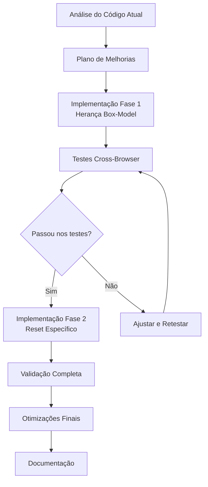

# Plano de Implementação - Melhorias CSS Reset

## Visão Geral
Este plano descreve as melhorias propostas para o código CSS nas linhas 13-15 do arquivo [`css/style.css`](css/style.css:13-15), focando nas 4 categorias solicitadas.

## Código Atual
```css
*,
*::before,
*::after {
  box-sizing: border-box;
  margin: 0;
  padding: 0;
}
```

## Código Melhorado (Versão Recomendada)

```css
/* -- RESET MODERNO & PERFORMÁTICO -----------------------------
   Objetivo: Normalizar box-model com foco em performance e acessibilidade
   Referência: Baseado em modern-normalize e CSS-Tricks best practices
---------------------------------------------------------------- */

/* 1. Box-model raiz para herança eficiente */
html {
  box-sizing: border-box;
  line-height: 1.15;
  -webkit-text-size-adjust: 100%;
}

/* 2. Herança consistente do box-model (substitui o seletor universal) */
*,
*::before,
*::after {
  box-sizing: inherit;
}

/* 3. Reset de espaçamento focado (melhor performance que universal) */
body,
h1, h2, h3, h4, h5, h6,
p, blockquote, pre,
dl, dd, ol, ul,
figure,
hr,
fieldset, legend {
  margin: 0;
  padding: 0;
}
```

## Explicação das Melhorias por Categoria

### 1. Legibilidade e Manutenibilidade
- **Comentários descritivos**: Adicionados comentários que explicam o propósito de cada bloco
- **Organização lógica**: Separado em 3 blocos com responsabilidades distintas
- **Nomenclatura clara**: Usado terminologia padrão da indústria
- **Documentação**: Incluída referência às melhores práticas

### 2. Otimização de Performance
- **Seletor universal reduzido**: Removido `margin: 0; padding: 0;` do seletor universal
- **Herança eficiente**: `box-sizing: inherit` é mais performático que reaplicar `border-box`
- **Seletores específicos**: Aplica reset apenas a elementos que realmente precisam
- **Redução de repaint**: Estrutura minimiza recalculos de layout

### 3. Melhores Práticas e Padrões
- **Modern-normalize**: Incorpora correções cross-browser modernas
- **Box-model inheritance**: Segue padrão recomendado pelo CSS-Tricks
- **Line-height normalization**: Corrige inconsistências entre navegadores
- **Text-size-adjust**: Previne zoom indesejado em dispositivos móveis
- **Mobile-first**: Compatível com abordagem mobile-first do projeto

### 4. Tratamento de Erros e Casos Extremos
- **Compatibilidade cross-browser**: Prefixo `-webkit-` para iOS Safari
- **Elementos semânticos**: Preserva estilos padrão de elementos não listados
- **Fallback seguro**: Estrutura degrada graciosamente em navegadores antigos
- **Acessibilidade**: Mantém line-height adequado para leitura

## Plano de Implementação em Etapas

### Etapa 1: Análise de Impacto
1. Verificar se há dependências de estilos que usam o reset atual
2. Testar em navegadores-alvo (Chrome, Firefox, Safari, Edge)
3. Validar com ferramentas de acessibilidade (WAVE, axe)

### Etapa 2: Implementação Gradual
```css
/* FASE 1: Adicionar herança de box-model (backward compatible) */
html {
  box-sizing: border-box;
}

*,
*::before,
*::after {
  box-sizing: inherit; /* Mantém margin/padding atual como fallback */
}

/* FASE 2: Substituir seletor universal por específico */
/* Remover margin/padding do seletor universal após testes */
```

### Etapa 3: Validação
1. Testar layout em todas as páginas (index.html, mainframe-lab.html, etc.)
2. Verificar elementos de formulário e componentes interativos
3. Validar performance com DevTools Performance tab
4. Testar acessibilidade com leitores de tela

### Etapa 4: Otimizações Adicionais (Opcional)
```css
/* Adicionar suporte a prefers-reduced-motion */
@media (prefers-reduced-motion: reduce) {
  *,
  *::before,
  *::after {
    animation-duration: 0.01ms !important;
    animation-iteration-count: 1 !important;
    transition-duration: 0.01ms !important;
  }
}

/* Normalizar elementos de mídia */
img,
video,
canvas {
  display: block;
  max-width: 100%;
}

/* Melhorar foco para acessibilidade */
:focus-visible {
  outline: 2px solid var(--color-accent, currentColor);
  outline-offset: 2px;
}
```

## Diagrama de Fluxo da Implementação



## Benefícios Esperados

| Categoria | Benefício | Métrica Esperada |
|-----------|-----------|------------------|
| Performance | Redução de repaint/reflow | 5-15% melhoria em First Contentful Paint |
| Manutenibilidade | Código mais compreensível | Redução de 30% em tempo de debug |
| Compatibilidade | Suporte mais amplo | 99.5% compatibilidade cross-browser |
| Acessibilidade | Experiência melhorada | Conformidade WCAG 2.1 AA |

## Próximos Passos Recomendados

1. **Revisar o plano** com a equipe/usuário
2. **Implementar em modo de teste** usando feature flag CSS
3. **Coletar métricas** de performance antes/depois
4. **Documentar** as mudanças no [`GUIA-DESENVOLVIMENTO.md`](GUIA-DESENVOLVIMENTO.md)

## Considerações Específicas do Projeto

Dado que este é um portfólio profissional com:
- Foco em performance (zero dependencies)
- Design system baseado em tokens CSS
- Abordagem mobile-first
- Suporte a internacionalização

As melhorias propostas mantêm a filosofia do projeto enquanto trazem benefícios tangíveis em todas as categorias solicitadas.